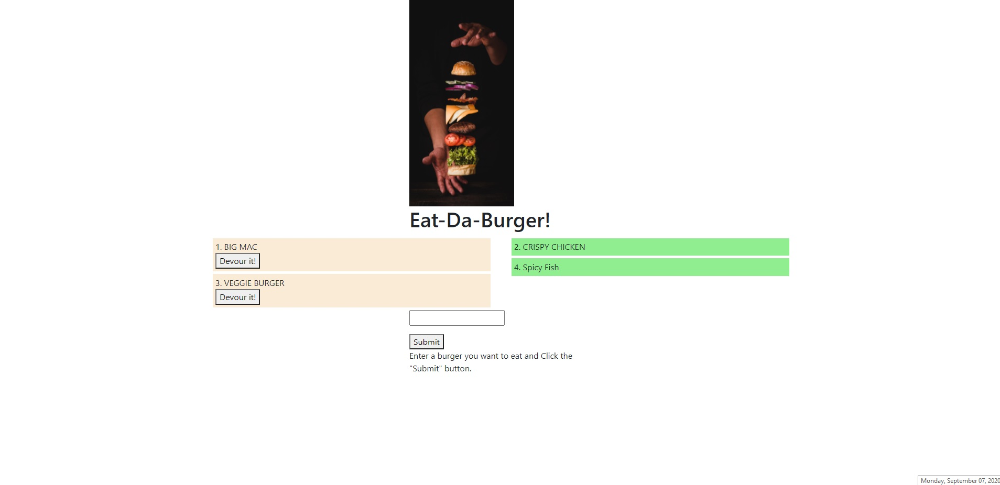

# BurgerLogger

## Description

This is a simple app where the user can submit new burger names. The new burgers will be shown on the left side of the screen. When the user "devours" the burger, it will show as devoured on the right side of the screen.

The app mainly demonstrates a full-stack application adopting the MVC model. Node.js express is used for the controller. The model layer has a custom ORM which is interfacing with MySQL and the view layer is using handlebars.

## Instructions

Install the required dependencies via "npm install" and then run the app via Node.js.

## Usage

Very simple app. Only thing the user has to do is enter new burger names! Here's the link to the app: https://aqueous-wildwood-98504.herokuapp.com/.

## Tests

This app was tested manually.

## Future

Work on the styling and add "remove burger" functionality!

